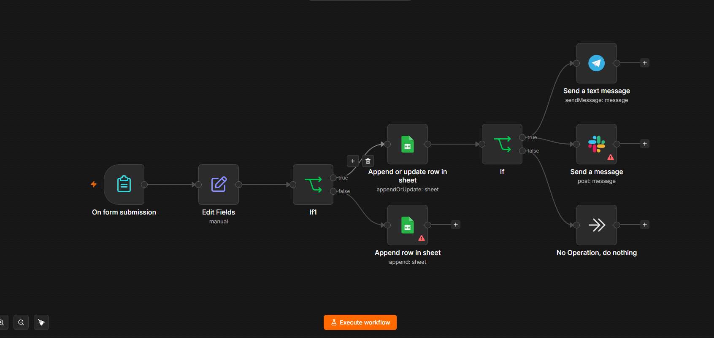
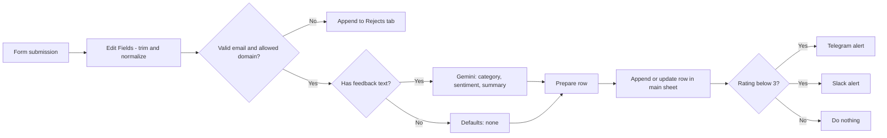

# Feedback Intake Automation (n8n)

A feedback form that validates every submission, classifies the feedback with AI, saves clean entries to Google Sheets, alerts me about low ratings, and tells me when the workflow itself breaks.

Built with [n8n](https://n8n.io), Google Sheets, Google Gemini, Telegram and Slack.

## What it does

1. A visitor fills in a form: **Name**, **Email**, **Rating** (1-5) and optional **Feedback**.
2. The workflow cleans the data: trims the name, lowercases the email and converts the rating to a number.
3. It checks the email. The address must be correctly formatted **and** come from an allowed domain (`gmail.com`, `outlook.com`, `yahoo.com`, `hotmail.com`).
4. **Valid submissions with feedback text** are sent to a Gemini model, which returns a **category** (bug, feature request, praise or other), a **sentiment** (positive, neutral or negative) and a one-sentence **summary**. Submissions with no feedback text skip the AI and get `none`.
5. The row is saved to the main sheet. If the same email submits again, the existing row is updated instead of duplicated.
6. If the rating is **below 3**, a low-rating alert goes to Telegram and Slack, including the category, sentiment and summary.
7. **Invalid submissions** are saved to a separate `Rejects` tab with a reason, so nothing is silently lost.
8. If any step fails, a second workflow sends me a Telegram message with the workflow name, the failing node, the error message and a link to the execution.

## Repository contents

| File | Purpose |
| --- | --- |
| `workflows/feedback-intake.json` | Main workflow: form, validation, AI classification, Sheets, alerts |
| `workflows/error-alert.json` | Error workflow: Telegram message when the main workflow fails |
| `screenshots/workflow.png` | Screenshot of the main workflow canvas |

## Setup

### 1. Prepare the Google Sheet

Create one spreadsheet with two tabs and these headers in row 1. Names must match exactly.

| Tab | Headers |
| --- | --- |
| Main tab (for example `Sheet1`) | `Name`, `Email`, `Rating`, `Feedback`, `Category`, `Sentiment`, `Summary` |
| `Rejects` | `Name`, `Email`, `Rating`, `Feedback`, `Reason` |

### 2. Import the workflows

In n8n, create a new workflow, open the menu and choose **Import from file**. Import both files from `workflows/`.

### 3. Connect your own accounts

The exported files contain placeholders instead of real IDs, so you need to fill these in:

- **Google Sheets credential:** create one and select it in both Sheets nodes.
- **Both Sheets nodes:** pick your spreadsheet, and choose the main tab in one node and `Rejects` in the other.
- **Google Gemini credential:** create an API key in [Google AI Studio](https://aistudio.google.com), add it as a credential in n8n, and select it in the Google Gemini Chat Model node. Pick a Flash or Flash-Lite model from the dropdown if the saved model is not available.
- **Telegram credential and chat ID:** set them in the low-rating alert node in the main workflow and in the alert node of the error workflow.
- **Slack credential and channel:** set them in the Slack node.

### 4. Link the error workflow

Open the main workflow, go to **Settings > Error Workflow**, and select the imported error workflow. This step is easy to miss, and without it failures are not reported.

### 5. Publish and test

Publish both workflows. Open the form's **Production URL** (not the Test URL) and submit these cases:

| Input | Expected result |
| --- | --- |
| Valid Gmail address, rating 5, praising feedback | Row saved with category `praise` and sentiment `positive`, no alert |
| Valid Gmail address, rating 2, feedback describing a problem | Row saved with AI fields, Telegram and Slack alerts that include them |
| Valid Gmail address, any rating, no feedback text | Row saved with `none` in Category and Sentiment, AI not called |
| A well-formed address at a non-allowed domain, such as `user@notamail.com` | Row saved to `Rejects`, not to the main sheet, AI not called |
| Same email submitted twice | One row, updated |

To test the error alert, temporarily break a node (for example, put invalid syntax in an expression), submit the form through the Production URL, and check Telegram. Error workflows only run on published, automatic executions, not on manual test runs.

## Design notes

- **Validation before saving:** bad data is filtered before it reaches the main sheet, and rejected entries are kept with a reason for review.
- **AI only when there is something to classify:** empty feedback skips the model call, which saves quota and avoids meaningless labels.
- **Constrained AI output:** the Information Extractor node asks for three named fields with fixed allowed values, and the model temperature is set to 0 so the same text gets the same label.
- **Deduplication by email:** the main sheet uses Append or Update matched on the `Email` column.
- **Separate error workflow:** keeping it in its own workflow means it can be reused by other projects.

## Known limitations

- **AI labels can be wrong.** Treat category and sentiment as a first pass, not a verdict.
- **Free-tier data handling.** Free Gemini API usage may be used by Google to improve its products, so use test data only, and switch to a paid key before handling real customer feedback.
- **Rate limits.** The free tier limits how many requests can be made per minute. A burst of submissions could fail, and the error workflow would report it.
- **The domain allowlist is a simple check.** It blocks real business addresses, and it only checks the domain name, not whether the mailbox exists.
- **Format validation cannot detect fake addresses** at an allowed domain.
- **Google Sheets is used as the data store.** It is fine for a small project, but a database would suit higher volume.
- **I run n8n locally,** so the form URL only works while n8n is running. A real deployment would host n8n on a server.

## Planned improvements

- Save the row with a fallback label such as `unclassified` when the AI call fails, instead of stopping the run.
- Replace the allowlist with an email verification API, or a confirmation email link.
- Add a scheduled weekly digest with the average rating, a count per category and the lowest-rated comments.

## Author

Sofiqul Sohan
